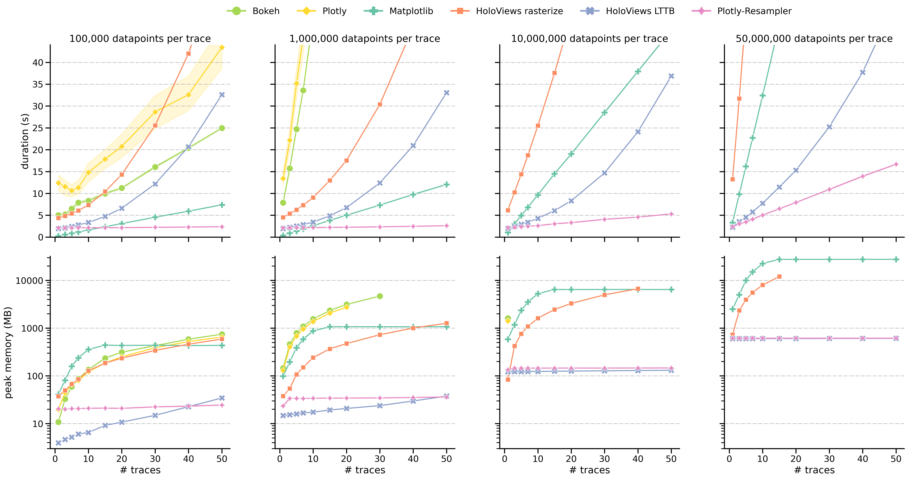

# plotly-resampler benchmarks

## <p align="center"> <a href="https://predict-idlab.github.io/plotly-resampler/"></a></p>


[](http://makeapullrequest.com) 

This repository withholds the [benchmark results](reports/benchmark_fig.png) and visualization code of the `plotly-resampler` paper and [toolkit](https://github.com/predict-idlab/plotly-resampler).




## Flow

The benchmark process follows these steps for each feature-extraction configuration:

1. The corresponding feature-extraction Python script is called. This is done 20 times to average out the memory usage and create upper memory bounds. Remark that by (re)calling the script sequentially, no caching or memory is shared among the separate script-executions.
2. In this script:
   1. Construct the synthetic as a [pd.DataFrame](https://pandas.pydata.org/docs/reference/api/pandas.DataFrame.html)
   2. [VizTracer](https://github.com/gaogaotiantian/viztracer) starts logging
   3. Construct the graph
   4. Render the graph(using Selenium and wait till everything is shown) 
   5. VizTracer stops logging
   6. Write the VizTracer results to a JSON-file

The existing [benchmark JSONS](code/benchmark_jsons/) were collected on a desktop with an `TODO` CPU and `TODO` RAM, with *Arch Linux* as operating system. Other running processes were limited to a minimum.

## Instructions

To install the required dependencies, just run:

```bash
poetry install
```

If you want to **re-run the benchmarks**, use the [run_scripts](code/run_scripts.ipynb) notebook to generate new benchmark JSONs and then visualize them with the [benchmark visualization](code/benchmark_visualizations.ipynb) notebook.

## Contributing

We are open to new-benchmark use-cases via **pull-requests**!<br>

> Examples of other interesting benchmarks are
>  * other data properties
>  * other eligible tools
>  * benchmarking graph-interaction response time.

<br>

---
<p align="center">
👤 <i>Jonas Van Der Donckt</i>
</p>
