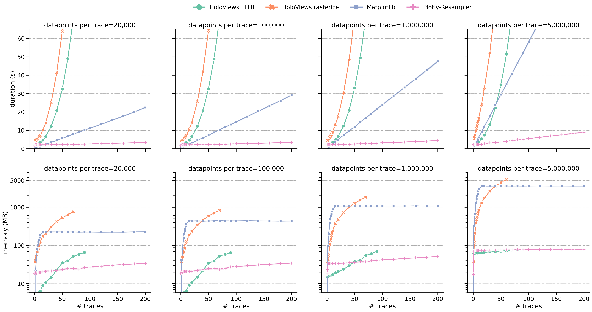

# Benchmark results for a line-graph visualization task.

More information regarding benchmarking process [here](../README.md#flow).

10 runs for each configuration -> shaded graph area depicts a 95% confidence interval..

## Paper figure

The first row displays the average duration of constructing and rendering the graph.
The second row indicates the peak RAM usage.
The columns indicate the data size per signal, thus showing a trend when scaling to larger datasets.
For each toolkit-approach a distinct color and style is applied.
`HoloViews LTTB` uses *Plotly-Resampler*'s LTTB aggregation functionality, whereas
`HoloViews rasterize` uses the built-in Datashader-rasterize function to enable dynamic aggregation.

**interpretation**:
> The first row represents the total time to construct and render the visualization.
> The slope of all approaches seems to rise with the increasing number of data points per trace. 
> Remark that `HoloViews`-based approaches scale exponentially in terms of the number of visualized traces, rendering them unsuitable for large multivariate visualizations (*more clear in the second visualization*). 
> When dealing with more than 10,000,000 samples per series and more than 10 modalities, `Plotly-Resampler` clearly emerges as the only viable toolkit.
> The second row indicates how the memory usage of both `Plotly-Resampler` and `HoloViews LTTB` scales better. 
> These two toolkit-approaches manage to use <700 MB RAM for even the largest configuration (right column), whereas `Matplotlib` and `HoloViews rasterize` exceed 10 GB.

---

## Scaling to large multivariate data

**Remark**
* In contrast with the figure above, up to 200 traces are displayed on the xaxis.
* During benchmarking whe stopped scaling to larger traces when graph construction time exceeed 120 seconds.

**interpretation**:
* As shown in the 

