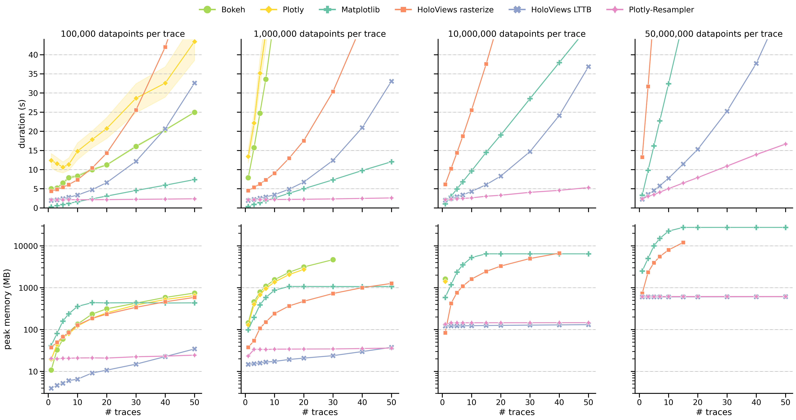
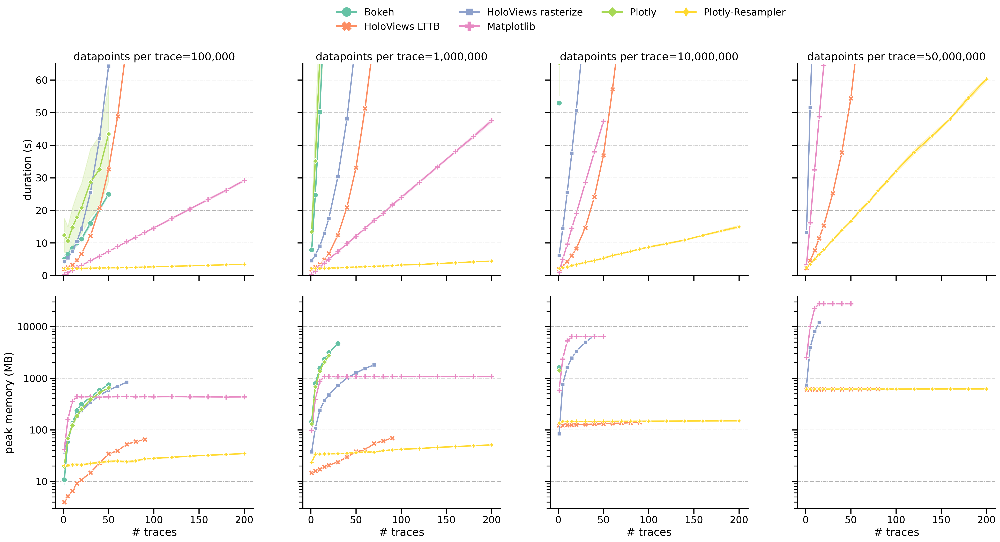

# Benchmark results for a line-graph visualization task.

More information regarding benchmarking process [here](../README.md#flow).

10 runs for each configuration -> shaded graph area depicts a 95% confidence interval..

## Paper figure

**Generic figure description**:
* The first row displays the average duration of constructing and rendering the graph.
* The second row indicates the peak RAM usage.
* The columns indicate the data size per signal, thus showing a trend when scaling to larger datasets.
* For each toolkit-approach a distinct color and style is applied.
> **note**: 
> * `HoloViews LTTB` uses *Plotly-Resampler*'s [LTTB](https://github.com/predict-idlab/plotly-resampler/blob/1b4fc6f6aa1b0e65c166a1f39e67c7ba3b2b4cf7/plotly_resampler/aggregation/aggregators.py#L21) aggregation functionality
> * `HoloViews rasterize` uses the built-in Datashader-[rasterize](https://holoviews.org/user_guide/Large_Data.html) function to enable dynamic aggregation.

**interpretation**:
> The first row represents the total time to construct and render the visualization.
> * The slope of all approaches seems to rise with the increasing number of data points per trace. 
> * `HoloViews`-based approaches scale exponentially in terms of the number of visualized traces, rendering them unsuitable for large multivariate visualizations (*more clear in the [second visualization](#scaling-to-large-multivariate-data)*).
> * When dealing with more than 10,000,000 samples per series and more than 10 modalities, `Plotly-Resampler` clearly emerges as the only viable toolkit.
>
> The second row indicates how the peak memory usage.
> * It is clear that `Plotly-Resampler` and `HoloViews LTTB` scale better.
> These two toolkit-approaches manage to use <700 MB RAM for even the largest configuration (right column).
> * `Matplotlib` and `HoloViews rasterize` exceed 10 GB.

---

## Scaling to large multivariate data

**Remark**
* In contrast with the figure above, up to 200 traces are displayed on the xaxis.
* During benchmarking whe stopped scaling to larger traces when graph construction time exceeed 120 seconds.

**interpretation**:
> * As also shown in the [paper figure](#paper-figure), **`HoloViews`-based approaches scale exponentially in duration** with respect to the number of traces.
> * `Plotly-Resampler` is the only tool able to visualize the most challenging configuration (200 traces, 50M datapoints per trace) under 120 seconds. More specifically, it needs 60 seconds to do so.

